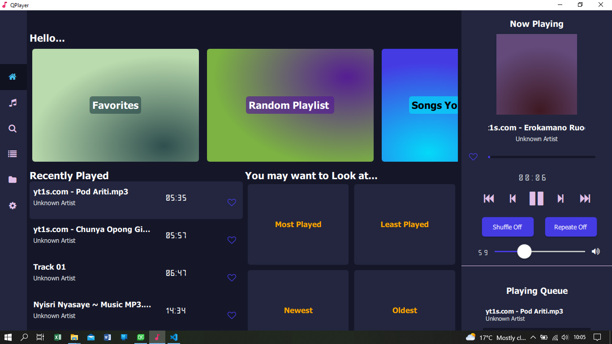
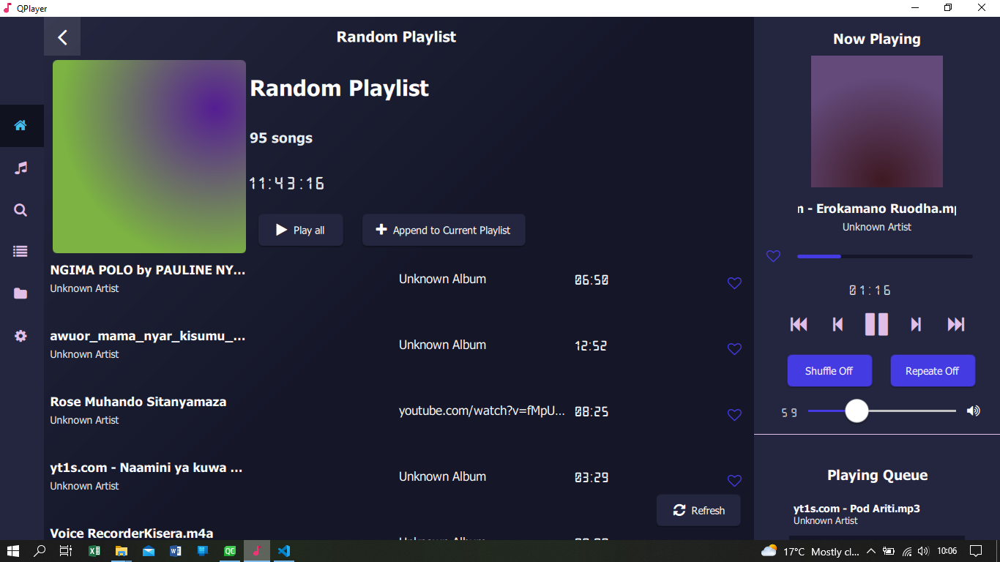

# QPlayer-DesktopMediaPlayer
CrossPlatform Music player built with Qt and Felgo. 

## Open Source Libraries Used
1. TagLib
2. VlcQt - LibVlc.

Screens

.

The design was inspired by [Vicky Prandana 10Am Studio](https://dribbble.com/shots/16744006-SingItOut-a-Music-Player-Desktop-App)
